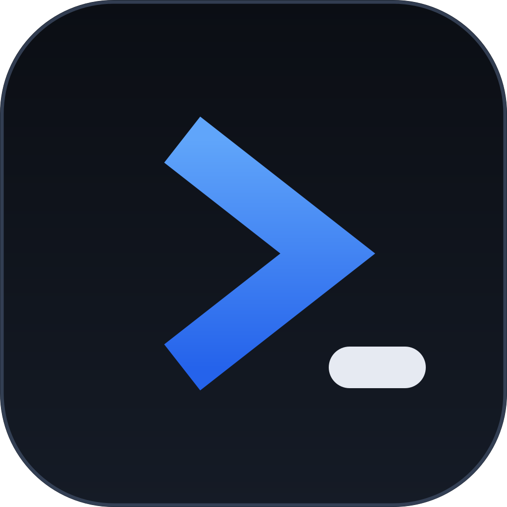

<div align="center">



# PromptBranch

**A local-first prompt library and version-control system for AI prompts**

[](LICENSE)

</div>

---

PromptBranch is a local-first prompt library and version-control system for
managing and evolving AI prompts. The 0.1.0 desktop app is available for
macOS, while the CLI and MCP server make the library cross-platform. The
library is a single SQLite file on your own disk; the desktop UI, CLI and MCP
server all work against the same store, and AI agents go through a
propose-and-approve flow so humans stay in charge.

## Features

- 📚 **Library** — prompt CRUD with soft delete, tags, collections, starred
  prompts, filters/sort, instant full-text search (⌘K), History and Notes
  tabs, JSON import/export and automatic local backups.
- 🌿 **Versioning** — branches, append-only per-branch sequential versions
  with change notes and a current pointer, a diff view for any two versions,
  and "duplicate as variation" branching.
- 🧪 **Evaluation** — 1–5 ratings across four dimensions, a run log
  (Results tab), an LLM judge that scores run outputs, side-by-side compare
  of any two runs and an evaluation summary.
- ⚡ **AI runs** — a [models.dev](https://models.dev)-backed provider catalog
  (OpenAI, Anthropic, Google, OpenAI-compatible endpoints) with
  safeStorage-encrypted API keys, streaming multi-model runs (up to
  6 models concurrently) with token/cost tracking.
- 🤖 **Agent integration** — a CLI and an MCP server over the same library;
  agent-reported runs and notes, and a Suggestions review queue — agents
  propose, humans approve.
- 🔗 **Sharing** — publish immutable prompt snapshots to the sharing portal
  behind unguessable URLs, with a pre-publish secret scan,
  `promptbranch://import` deep links, revocable delete tokens and a Shares
  view in the app.
- 🔄 **Multi-device sync** — peer-to-peer over the local network, no server and
  no account. In 0.1.0, pair macOS desktop devices with a short code
  (Signal-style verification against the device certificate), then changes
  flow automatically whenever they can reach each other. The sync architecture
  is designed to support future desktop platforms. Offline-first: every change
  is durable locally the moment it's written, and sync is pure catch-up when
  devices meet.

## Installation

PromptBranch desktop 0.1.0 is currently available only for macOS, with native
builds for Apple Silicon (arm64) and Intel (x64). Download one of these four
files from [GitHub Releases](https://github.com/PromptBranch/promptbranch/releases):

- `promptbranch_0.1.0_macos_arm64.dmg`
- `promptbranch_0.1.0_macos_arm64.zip`
- `promptbranch_0.1.0_macos_x64.dmg`
- `promptbranch_0.1.0_macos_x64.zip`

Windows and Linux desktop builds are planned, but no installers for those
platforms are available in 0.1.0. The CLI and MCP server remain
cross-platform; setup instructions live in
[`docs/getting-started/installation.md`](docs/getting-started/installation.md).

## Where your data lives

The desktop app, CLI and MCP server all open the same database:

| Platform | Path |
|---|---|
| macOS | `~/Library/Application Support/PromptBranch/library.db` |
| Linux | `$XDG_CONFIG_HOME/promptbranch/library.db` |
| Windows | `%APPDATA%\PromptBranch\library.db` |

Set `PROMPTBRANCH_DB=/path/to.db` to point any entry point at a different
library (for example, a separate personal or test library).
If you used a pre-release build (named *PromptBuilder* or *PromptHub*), the
app copies your existing library into the new location on first launch and
leaves the original untouched.

It is safe to run the CLI or MCP server while the desktop app is open —
they share the database file. The app picks up new runs, notes, ratings and
suggestions when you focus the window.

## Agent integration

AI coding agents interact with your library through two thin adapters — the
CLI and the MCP server — with the same semantics as the app UI. The rule is
**agents propose, humans approve**: agents can read prompts, report runs and
notes, and *suggest* variations, but a suggested variation is created as a
**pending** version that is invisible to search and listings and cannot become
current until a human approves it in the app's **Suggestions** view (left
rail, with a pending-count badge; approve optionally sets it as current,
reject keeps it permanently inactive).

Onboarding is copy-paste: open Settings → *Agent integration* for the resolved
DB path and a ready-to-paste MCP client config. The npm package also includes
an optional skill file that teaches coding agents the fetch → report → suggest
workflow.

### MCP server

`@promptbranch/mcp` is available from npm. Point any stdio-capable MCP client
at it with this configuration:

```json
{
  "mcpServers": {
    "promptbranch": {
      "command": "npx",
      "args": ["-y", "@promptbranch/mcp"]
    }
  }
}
```

Tools: `get_prompt`, `search_prompts`, `list_prompts`, `report_run`,
`add_note`, `suggest_variation`. Prompts are referenced by title (exact, then
case-insensitive, then unique substring — ambiguous matches return the close
candidates) or by id. `suggest_variation` returns a pending suggestion; tell
your human to open the Suggestions view to review it.

### CLI

The CLI provides the same surface for shell pipelines. Run the public package
without a global install as `npx -y @promptbranch/cli`, or install it globally
to use the shorter `promptbranch` command. All commands accept `--json` for
machine-readable output:

```sh
promptbranch list --tag security
promptbranch get "security-audit" > /tmp/prompt.md
promptbranch search "sql injection"
promptbranch report-run --prompt "security-audit" --tool kimi-cli --model k2 --outcome 4 --summary "found 2 issues"
promptbranch add-note --prompt "security-audit" --body "works well on small diffs"
promptbranch suggest --prompt "security-audit" --file improved.md --rationale "tighter scope"
promptbranch suggestions   # pending review queue
promptbranch db-path       # prints the resolved database path
```

Sharing is human-only — `publish` and `import` exist only here and in the
desktop app; there is intentionally no MCP tool for pulling internet content
into the library.

## AI providers

PromptBranch can run prompts against real models and use AI to draft or improve
prompts. Supported providers: **OpenAI**, **Anthropic**, **Google**, and any
**OpenAI-compatible** endpoint (Ollama, LM Studio, …) via a custom base URL.

Setup is one step: Settings → AI Providers → **Connect a provider** → paste the
API key (encrypted with your OS keychain via Electron `safeStorage`; keys are
decrypted only inside the app at execution time). The connection is tested
automatically as part of connecting, and the model catalog refreshes in the
background. If `OPENAI_API_KEY`, `ANTHROPIC_API_KEY` or
`GOOGLE_GENERATIVE_AI_API_KEY` is set in the environment, PromptBranch offers
a one-click **Use environment key** connect for that provider.

Once connected, every catalog model of the provider is immediately usable —
there is no model-selection step in Settings. Models are picked from the
searchable model picker next to the Run button (filter as you type, grouped by
provider, with context-window/pricing hints and per-prompt recents). Individual
models can be hidden from the picker's hover action; everything else just
works. OpenAI-compatible endpoints have no catalog, so their model ids are
declared inline on the provider's settings row.

The model catalog comes from [models.dev](https://models.dev) and is cached
locally. Browsing and editing stay offline; catalog refreshes, model runs, and
sharing use the network. A failed catalog refresh keeps
serving the stale cache.

Each Run executes the prompt (after `{{variable}}` substitution) against up to
6 models concurrently and records one entry per model — provider, model,
status, output or error, latency, token usage and estimated USD cost from
catalog pricing — grouped together for the compare view.

## Sharing

Snapshots are immutable and live behind unguessable `/p/<id>` URLs on the
official portal, <https://promptbranch.app>.

- **Publishing** happens from the Share dialog on the prompt toolbar (scope
  choice, pre-publish secret scan, exact-payload preview). Delete tokens are
  stored locally so shares can be revoked later from the **Shares view** in
  the left rail (search, status filtering, copy link, revoke).
- **Importing** works via `promptbranch://import?url=` deep links or
  `promptbranch import`; snapshots come back as regular local prompts tagged
  with their origin.

## Multi-device sync

Sync your library across your own computers, directly, with **no server and
no account**: devices discover each other on the local network via mDNS,
authenticate with a one-time pairing code, and exchange incremental
record-level changes over mutually-pinned TLS. Enable it in
**Settings → Sync**; a status line in the left-rail footer shows
*Synced / Syncing / Waiting for devices* at a glance.

- **How it works**: every change (from the app, the CLI or the MCP server —
  they share the database file) is captured into a local op log with
  logical-clock revisions; peers exchange the ops they're missing and merge
  them deterministically. Append-only records (versions, notes, ratings,
  runs) union by id; small mutable fields resolve last-writer-wins; same-name
  tags/collections/branches merge into one row. Concurrent edits to a prompt
  simply produce concurrent versions in its history.
- **Trust**: each device has a self-signed certificate; the 8-character
  pairing code is derived from the accepting device's certificate
  fingerprint, so a man-in-the-middle on the network produces a mismatching
  code. Forgetting a device unpins it permanently. API keys never leave a
  device, and settings are deliberately device-local. Share records do sync
  (delete tokens included), so shares can be managed and revoked from any
  paired machine.
- **Reach**: sync happens when devices are on the same network (or a VPN —
  pair by address in Settings → Sync → *Add a device*). Changes wait while
  devices are apart; nothing is ever "pending upload", because changes are
  durable the moment they're written.
- **macOS note**: the first sync session triggers the system's Local Network
  permission prompt — allow it, or pairing and discovery won't see peers.

## Documentation

Full documentation lives in [`docs/`](docs/SUMMARY.md):

- [Overview & Philosophy](docs/getting-started/overview.md) ·
  [Installation](docs/getting-started/installation.md) ·
  [Quickstart](docs/getting-started/quickstart.md) ·
  [Core Concepts](docs/getting-started/core-concepts.md)
- Features — [Prompt Management](docs/features/prompt-management.md),
  [Search & Organization](docs/features/search-and-organization.md),
  [Multi-Model Execution](docs/features/ai-execution-and-models.md),
  [LLM Judge](docs/features/llm-judge-and-evaluations.md),
  [AI Assist](docs/features/ai-assist.md)
- Integrations — [MCP Server](docs/integrations/mcp-server.md),
  [CLI](docs/integrations/cli.md),
  [AI Providers](docs/integrations/ai-providers.md)
- [Peer-to-Peer Sync](docs/sync/peer-to-peer-sync.md) ·
  [Link Sharing](docs/sharing/link-sharing-and-portal.md) ·
  [Configuration & Environment](docs/reference/configuration-and-env.md)

## License

PromptBranch is released under the [MIT License](LICENSE). The third-party
software bundled with the app is listed in
[THIRD_PARTY_NOTICES.md](THIRD_PARTY_NOTICES.md) and is also viewable
in-app via **About → Open Source Licenses**.
